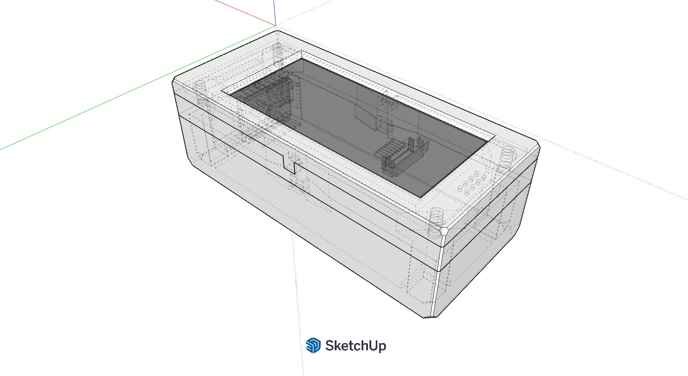

# todoscheme
A small arduino-based device with a 2"9 e-paper screen with a 3D printed casing

A Sketchup model for the casing:

https://app.sketchup.com/share/tc/northAmerica/NtC7QBoEuRY?source=web&stoken=mcNGkTcyrEo898i_c445EI8pAUjvKsfaaLVGlP7pjdS9xwqmc0Z1676cIbZqI9Pg
